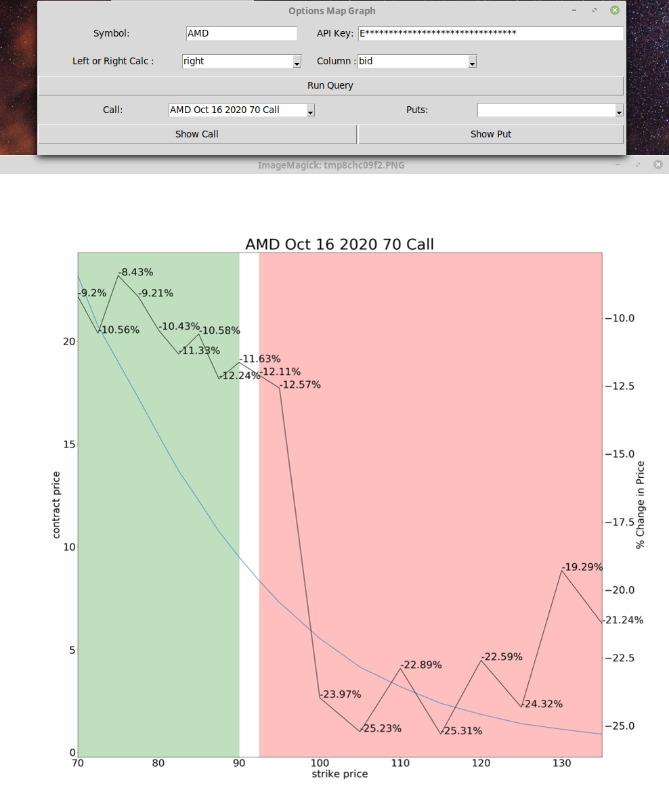

# Options  Analytical Tool
I found it helpful to know where the price of options changed most drastically. Knowing this tells one where the risk 
drops of the greatest, helping one identify the options with the best risk/rewards. 

The underlying math is simple. It is just the the percent change between two adjacent strike prices

The GUI is also simple, it provides graphs of the option chains, plotted by  expiration date.

## Some notes on reading it

Red highlight is OTM

Green is ITM

Black line is the change in contract price against strike price.

Blue Line is current option price

API Key is a TDA api Key

Column is the column to perform calculations on

Left is descending strike price calculation, right calc is ascending

## Example of Output
